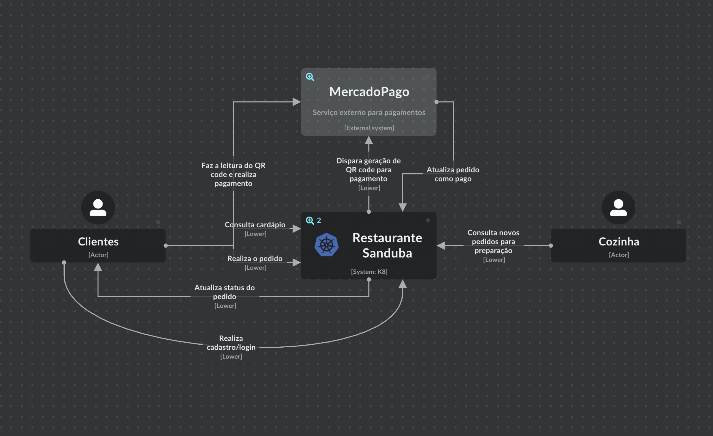
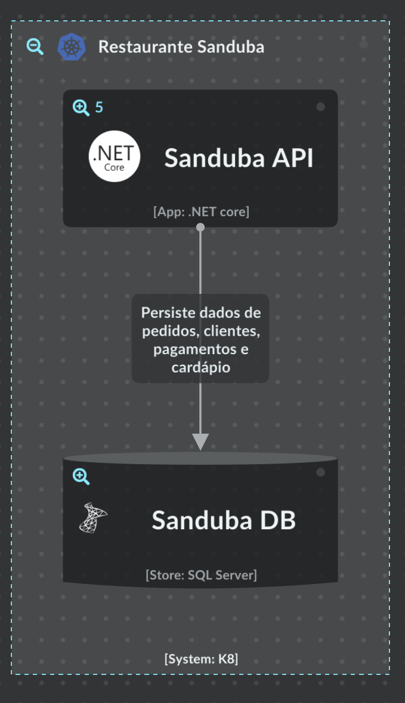
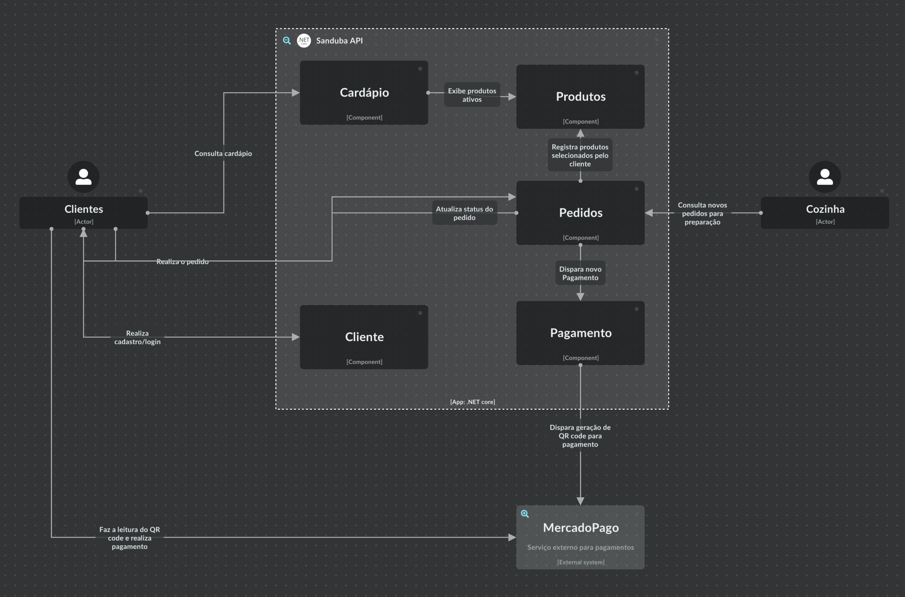

# tech-challenge-fiap
Projeto de entrega para POS Tech FIAP de Victor Cangelosi de Lima RM352065

## Video Youtube Módulo 2

## Video Youtube Módulo 3

> [!Note]
> 
> Algumas das configurações que fiz estão concentradas na minha página de "atalhos" [TLDR](https://github.com/cangelosilima/TLDR). Estou usando o [Windows Developer Environment](https://github.com/cangelosilima/TLDR/tree/main/win-developer-env/README.md)

## Estrutura do projeto

### Documentação
A documentação deste projeto é estruturada de maneira organizada para garantir uma experiência intuitiva aos visitantes. Cada contexto, como Docker, Kubernetes e APIs, possui seu próprio conjunto de informações contido em um README específico, localizado dentro da pasta `docs`. A única exceção é o README do repositório principal, mantido fora dessa pasta para simplificar o acesso aos visitantes.

A intenção por trás dessa abordagem é proporcionar uma experiência de navegação semelhante a uma wiki. Ao aprofundar-se nas pastas do projeto, os usuários podem localizar facilmente o tópico desejado e, ao mesmo tempo, manter a continuidade ao retornar ao ponto de partida. Isso não apenas facilita a compreensão do projeto, mas também simplifica a localização de informações específicas, contribuindo para uma interação mais eficiente com a documentação.

Além disso, para tornar a referência e navegação ainda mais fácil, cada link incluído na documentação será acompanhado por uma breve descrição. Isso permitirá aos usuários entenderem o conteúdo do próximo README antes de acessá-lo, garantindo uma transição suave entre os diferentes contextos do projeto.

### API Restaurante
O projeto `RestauranteSanduba` é centralizado em uma solução do Visual Studio, que abriga os diversos projetos relacionados à implementação da API, testes, documentação, entre outros. Essa estrutura organizada proporciona uma visão abrangente do ecossistema do projeto, permitindo fácil acesso e gerenciamento dos diferentes componentes, desde a implementação da API até os projetos de testes e documentação.

### C4 Model
Para criação dos digramas usando o modelo C4, utilizei o site [IcePanel](https://app.icepanel.io/) que facilita a criação e navegação entre os digramas previstos nessa modelagem. Para uma navegação dentro dos sistemas e suas interações acesso o [Sanduba - C4 Model](https://s.icepanel.io/3NzMSG0BWa6nvY/CH0k).

#### Diagrama de Contexto
Tem como objectivo demonstrar como os atores, no nosso caso usuário, interagem com nosso sistema e onde podemos agregar valor ao cliente:

</img>

#### Diagrama de Container
Aplicações e bases dentro de um sistema usado pelo usuário:

</img>

#### Diagrama de Componentes
Componentes dentro da aplicação:

</img>

[>> Documentação da API](api/RestauranteSanduba/docs/README.md)

### Docker
[Docker](https://www.docker.com/) é uma plataforma de código aberto projetada para facilitar a criação, implantação e execução de aplicativos em contêineres. Os contêineres são ambientes leves e portáteis que empacotam tudo o que é necessário para executar um software, incluindo o código, as bibliotecas e as dependências.

### Postman
O Postman é uma ferramenta de colaboração para o desenvolvimento de APIs. Ele oferece uma interface gráfica amigável que permite aos desenvolvedores criar, testar e documentar APIs de maneira eficiente.

[>> Documentação Postman](postman/docs/README.md)

 ### Kubernetes (aka k8s)
 [>> Documentação Kubernetes](kubernetes/docs/README.md)

